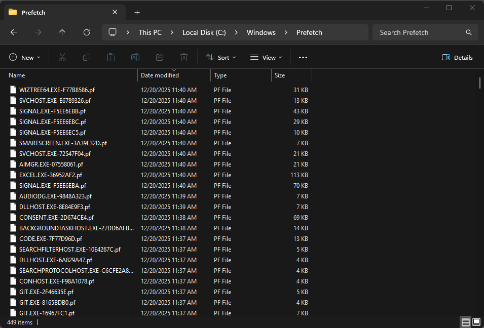

## Did you know?

Uninstalling an app doesn't delete the proof you ran it.

Windows keeps a *ghost file* of every program you executed to speed up loading times. It's called Prefetch.

Located in ```C:\Windows\Prefetch```, these .pf files log:
* The exact date & time you ran it.
* The file path it ran from
* The run count (How many times you executed it)

> Forensics teams use this to prove you ran CCleaner or Malware.exe even after you attempted to cover their tracks.



Prefetch is a nice reminder that "no .exe on disk" does not equal "no evidence". 

And it's only one artifact. Amcache, Shimcache, SRUM, registry, event logs... Windows is basically one big timeline generator, if you know where to look.

You wipe the Prefetch? Shimcache got you. You clear the Shimcache? SRUM logged the network packets.

## Analyzing Prefetch (.PF) Files

We'll use PECmd, a well-known tool to analyze Windows Prefetch data. PECmd is a **command-line** utility that parses prefetch files and extracts forensics metadata such as:
* Executable name and file path
* Run count (how many times the application was run)
* Execution timestamps
* Referenced files and directories
* Volume information
* Hash of the prefetch file

## Using PECmd
1) Download PECmd from: https://github.com/EricZimmerman/PECmd
2) Unzip the archive
3) Open a terminal in the working directory

Now you're ready to use PECmd. You have two options:

**1) Parse all Prefetch files**
```Powershell
.\PECmd.exe -d "C:\Windows\Prefetch" --csv C:\Output" --csvf prefetch.csv
```
**2) Parse one specific Prefetch file**
```Powershell
.\PECmd.exe -f "C:\Windows\Prefetch\EXCEL.EXE-36952AF2.pf"
```

## Sample PECmd Output

Let's analyze the ```EXCEL.EXE-36952AF2.pf``` file.


### What to Look For

* **Executable Name:** Confirms what program was run.
* **Run Count:** Tells you how many times it was executed. Great for spotting repeated or suspicious activity.
* **Last Run Timestamp**: User for for timeline reconstruction in investigations. _Times are in UTC_
* **Other Run Times Timestamp:**: Shows the last times the file was executed. _Times are in UTC_
* **Volume Information:**: Confirms which isk the file was from and help verify file integrity.
* **Directories/Files Referenced:** Demonstrates all the directories and files that the binary has touched.

### Highlighting Keywords

Prefetch output can be overwhelming. If you already know what you're looking for, for example, investigating Excel activity and the file it opened, you can use the ```-k``` flag to **highlight keywords**.

In this example, we wil highlight all ```.xlsx``` files Excel has touched.

```Powershell
\PECmd.exe -f "C:\Windows\Prefetch\EXCEL.EXE-36952AF2.pf" -k ".xlsx"
```
Only entries containing ```.xlsx``` in their referenced file will be highlighted, making it easier to focus on relevant activity.


## Applying PECmd to Malware Analysis

Prefetch files aren't just useful for tracking legitimate programs. They're a goldmine for **malware forensics**. Even if a malicious file is deleted, its Prefetch entry can reveal:
* Filename and path
* How many times it ran
* Timestamp of exection
* Other files or DLL's it interacted with
* Where it dumped payloads

This data lets analysis help reconstruct malware activity on the system, even if the binary itself is gone.

Prefetch essentially acts like a "ghost footprint" of malware, showing where it ran, and what it touched. Making it a key artifact in post-infection investigations.