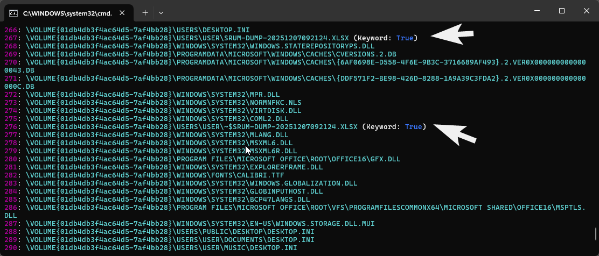

## Did you know?

Windows keeps a *ghost file* of every program you executed to speed up loading times. It's called **prefetch**.


Located in ```C:\Windows\Prefetch```, these .pf files log:
* The exact date & time you ran it
* The path it ran from
* The run count (how many times you ran it)
* Execution timestamps (time entry of each time you ran it)
* Referenced files & directories

> Uninstalling an application does not remove evidence that it was ever executed. Windows preserves execution artifacts to optimize performance, and those artifacts are often valuable in forensic analysis.

From a forensic perspective, this means execution history often persists even when binaries are removed or renamed.

## What's in your prefetch?

You can open your prefetch directory by running ```prefetch```, or with Powershell. Here we see all recently executed binaries and their timestamp.

```powershell
PS C:\windows\prefetch> ls | sort-object lastwritetime -descending

Directory: C:\windows\prefetch
       LastWriteTime         Length Name
       -------------         ------ ----
12/21/2025   9:01 AM          39481 QBITTORRENT.EXE-97E1315C.pf
12/21/2025   9:01 AM          21287 TASKHOSTW.EXE-1EAF2222.pf
12/21/2025   9:01 AM           6012 SVCHOST.EXE-C6F1CF5D.pf
12/21/2025   9:01 AM           4374 VDSLDR.EXE-35269815.pf
12/21/2025   9:00 AM           4556 RUNTIMEBROKER.EXE-FEEAFD19.pf
12/21/2025   9:00 AM          12451 SVCHOST.EXE-874EA4F5.pf
12/21/2025   9:00 AM          21124 MOUSOCOREWORKER.EXE-0BC6369F.pf
12/21/2025   9:00 AM           4196 SVCHOST.EXE-7C2F6448.pf
12/21/2025   9:00 AM          34081 RUFUS-4.11.EXE-198A8DA7.pf
12/21/2025   9:00 AM           8810 VDS.EXE-F11BF333.pf
```

Prefetch is a nice reminder that *file deleted* does not equal *no evidence*.

And it's only one artifact. Amcache, Shimcache, SRUM, registry, event logs... Windows is basically one big timeline generator, if you know where to look.

Prefetch was deleted? Shimcache got you. Shimchache deleted? SRUM logged the network packets.

## Analyzing prefetch files

We'll use PECmd, a well-known tool to analyze Windows Prefetch data. PECmd is a **command-line** utility that parses prefetch files and extracts forensics metadata such as:
* Executable name and file path
* Run count (how many times the application was run)
* Execution timestamps
* Referenced files and directories
* Volume information
* Hash of the prefetch file

## Using PECmd
1) Download PECmd from: https://github.com/EricZimmerman/PECmd
2) Unzip the archive
3) Open a terminal in the working directory

Now you're ready to use PECmd. You have two options:

**1) Parse all Prefetch files**
```Powershell
.\PECmd.exe -d "C:\Windows\Prefetch" --csv C:\Output" --csvf prefetch.csv
```
**2) Parse one specific Prefetch file**
```Powershell
.\PECmd.exe -f "C:\Windows\Prefetch\EXCEL.EXE-36952AF2.pf"
```

## Sample PECmd Output

Let's analyze the ```EXCEL.EXE-36952AF2.pf``` file.

```Powershell
PS C:\users\user\documents\pecmd> .\PECmd.exe -f "C:\Windows\Prefetch\EXCEL.EXE-36952AF2.pf"
PECmd version 1.5.1.0

Author: Eric Zimmerman (saericzimmerman@gmail.com)
https://github.com/EricZimmerman/PECmd

Command line: -f C:\Windows\Prefetch\EXCEL.EXE-36952AF2.pf

Warning: Administrator privileges not found!

Keywords: temp, tmp

Processing C:\Windows\Prefetch\EXCEL.EXE-36952AF2.pf

Created on: 2025-09-28 18:54:49
Modified on: 2025-12-21 13:49:29
Last accessed on: 2025-12-21 14:04:52

Executable name: EXCEL.EXE
Hash: 36952AF2
File size (bytes): 496,182
Version: null

Run count: 33
Last run: 2025-12-21 13:49:24
Other run times: 2025-12-20 17:12:17, 2025-12-20 17:05:24, 2025-12-20 16:40:07, 2025-12-19 18:57:40, 2025-12-18 19:49:49, 2025-12-17 22:51:20, 2025-12-17 13:30:15

Volume information:

#0: Name: \VOLUME{01db52b3a2ac64d5-7af4eb28} Serial: 2CF4FF26 Created: 2024-12-13 23:08:43 Directories: 88 File references: 339

Directories referenced: 88
<SNIP>
```

### What to look for

* **Executable Name:** Confirms what program was run.
* **Run Count:** Tells you how many times it was executed. Great for spotting repeated or suspicious activity.
* **Last Run Timestamp**: Used for for timeline reconstruction in investigations. _Times are in UTC_
* **Other Run Times Timestamp:**: Shows the last times the file was executed. _Times are in UTC_
* **Volume Information:**: Confirms which disk the file was from and help verify file integrity.
* **Directories/Files Referenced:** Demonstrates all the directories and files that the binary has touched.

### Filtering keywords

Prefetch output can be overwhelming. If you already know what you're looking for, e.g., investigating Excel activity to find the file it opened, you can use the ```-k``` flag to **highlight keywords**.

In this example, we will highlight all ```.xlsx``` files Excel has touched.

```Powershell
.\PECmd.exe -f "C:\Windows\Prefetch\EXCEL.EXE-36952AF2.pf" -k ".xlsx"
```
Only entries containing ```.xlsx``` in their referenced file will be highlighted, making it easier to focus on relevant activity.



## Applying PECmd to Malware Analysis

Prefetch files aren't just useful for tracking legitimate programs. They're a goldmine for **malware forensics**. Even if a malicious file is deleted, its Prefetch entry can reveal:
* Filename and path
* How many times it ran
* Timestamp of execution
* Other files or DLL's it interacted with
* Where it dumped payloads

This data lets analysis help reconstruct malware activity on the system, even if the binary itself is gone.

Prefetch essentially acts like a "ghost footprint" of system activity, showing where it ran, and what it touched. Making it a key artifact in post-infection investigations.