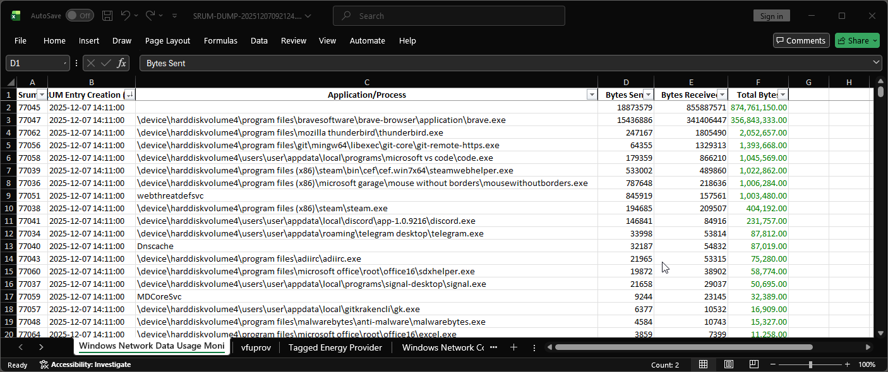

## Windows records everything you don't see

Your Windows device knows exactly how much data every single app has sent to the internet.

It's called **System Resource Usage Monitor** (SRUM).

SRUM contains a rolling database of network usage per process, typically covering the last 30-60 days.

The data is stored in ```C:\Windows\System32\sru\SRUBD.dat```

Forensics teams use this to prove exfiltration. It can also be analyzed to see what applications are sending data, how much data, and at what time the data was sent.

> Threat actor: "I didn't steal the company data!"
>
> SRUM: "Then why did Edge.exe upload 20Gb of data at 1am on a Saturday?"

SRUM is a reminder that transparency isn't optional on centralized systems; it's built in. The device becomes an investigator long before any investigator arrives. Even if you wipe the footprints, the terrain still shows where you ran.

## Accessing the SRUM database

The most common tool for SRUM analysis is **srum-dump** https://github.com/MarkBaggett/srum-dump.

It is an open-source forensic utility that extracts and parses the SRUDB.dat database into a structured format such as Excel or CSV for analysis.

Download the binary and run it as an **administrator**.

Follow the prompts to select your ```SRUBD.dat``` file and wait for the application to generate your report.

>This utility also supports CLI commands, which can be found documented on the vendor's Github.


## Key fields in SRUM analysis

Here's an example of a generated report:



The most important column in SRUM analysis is typically:

- **Application / Process Name**
- **Total Bytes Sent**
- **Total Bytes Received**
- **Timestamp Range**

It allows you to quickly identify unusual or suspicious binaries that may not align with normal workstation activity. Such as off-hours communication patterns, or unusual network-heavy processes.

## Common next steps

- **Sort by total bytes**
  - Identify processes consuming unexpected amounts of network bandwidth.
- **Filter timestamps**
  - Show activity occurring outside normal business hours.
- **Use Excel formulas or pivot tables**
  - Highlight anomalies, correlate processes, or enrich findings with other telemetry sources.

This forms the foundation for spotting persistence mechanisms, unauthorized data transfers, or binaries that simply don’t belong on the system.

## Closing insight

Users can deny activity. Processes cannot.

SRUM captures system behavior, and turns it into a persistent forensic record.