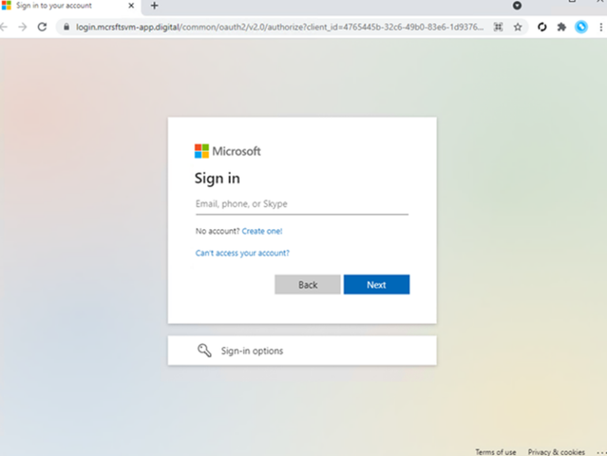

# Understanding Adversary-in-the-Middle Attacks in Microsoft 365 Identity Compromises

> *This case study is derived from real incident response work. All identifying details have been removed or generalized. Technical artifacts and investigative tradecraft are intentionally abstracted.*

***

## Incident Summary

An adversary-in-the-middle (AiTM) phishing attack resulted in the compromise of a Microsoft 365 identity despite multi-factor authentication being enabled. The incident highlights how assumptions around MFA effectiveness continue to break down under modern phishing techniques.

Rapid containment limited the impact of the incident, but investigation revealed systemic control gaps that made the compromise feasible in the first place.
## Initial Observations

The incident came to attention due to authentication activity inconsistent with the user’s prior sign-in patterns. The login originated from a source unaligned with expected geography, and from a datacenter-backed IP rather than residential network.

At this stage, the most important question was not *whether* the sign-in succeeded - it had - but **how MFA was satisfied** and **what access the attacker retained afterward**.
## Authentication and Identity Analysis

Sign-in telemetry showed characteristics consistent with an AiTM relay attack. In this model, user credentials and MFA challenges are proxied in real time through attacker-controlled infrastructure, allowing the attacker to capture authenticated session tokens rather than credentials alone.

In this case:

*   MFA was enabled and functioning as designed
*   Authentication was successful via token relay
*   Access originated from an unmanaged device context

No evidence was found of post-authentication persistence through OAuth grants or authentication method changes, which significantly reduced long-term risk once access was revoked.

*Pictured: A typical M365 AiTM page capable of stealing MFA tokens.*

## Mailbox and Activity Review

Mailbox and messaging telemetry was reviewed to evaluate potential abuse following authentication. The primary concern was whether the compromised identity was used for lateral phishing or business email compromise activity.

Outbound communication telemetry showed no evidence of email sent after the compromise. Likewise, no forwarding rules or mailbox-level persistence mechanisms were identified.

Audit visibility required correlation across multiple identity and mailbox data sources, reinforcing a recurring challenge in investigations: **no single telemetry source provides full coverage**.

## Phishing Campaign Context

The phishing email was part of a short-lived campaign targeting multiple recipients. At the time of investigation, the phishing infrastructure was no longer accessible - a common trait of credential harvesting operations that prioritize speed and disposal over longevity. It may also occur due to take-down orders by the web host.

At this point, further IOC expansion provided diminishing returns. The investigation focus shifted to assessing exposure, containment effectiveness, and control weaknesses rather than chasing infrastructure that had already been abandoned.

## Containment and Impact

Automated containment actions were executed shortly after detection, including session revocation and account disablement. Because the compromise was identified early and did not exhibit post-authentication abuse, impact was limited to credential exposure rather than downstream exploitation.

This underscores an important distinction: **early detection does not eliminate failure, it limits consequence**.

## Root Cause Considerations

The compromise was made possible by two conditions:

1.  The use of phishable MFA, which offers limited protection against real-time relay attacks
2.  The absence of endpoint-level preventive controls on unmanaged devices, allowing access to malicious infrastructure

These are not novel findings. They are well-documented patterns that continue to surface as identity becomes the primary attack surface.

## Closing Thoughts

AiTM attacks expand the gap between perceived and actual identity security. MFA, while necessary, is no longer sufficient.  Threat actors have methods to trick the user into forfeiting their MFA code.  Some times its as simple as the user approving an MFA request they did not make.